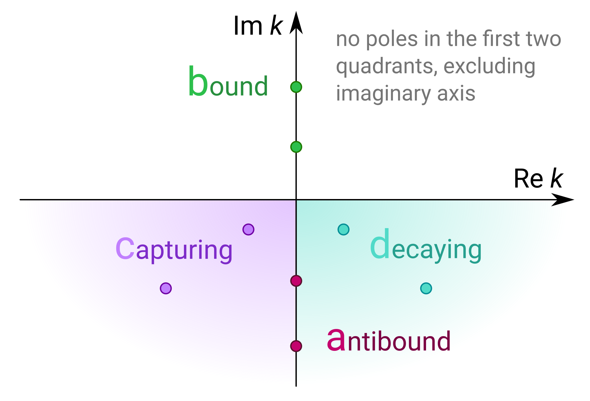
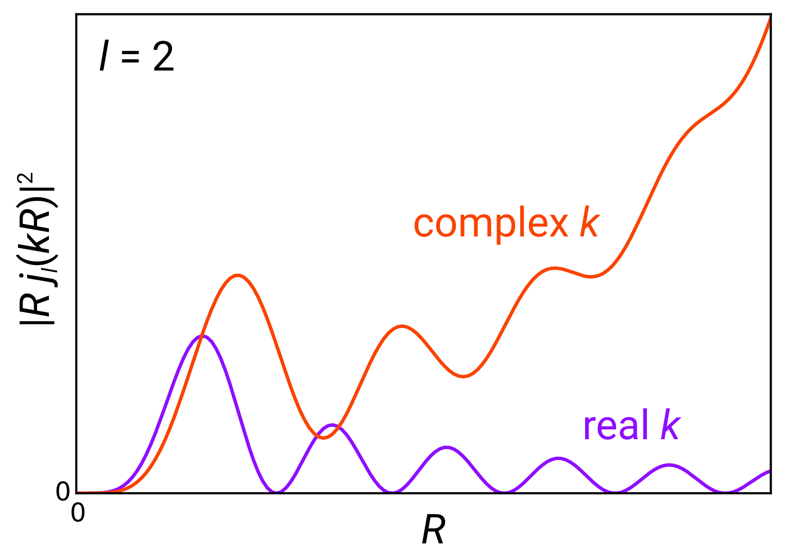
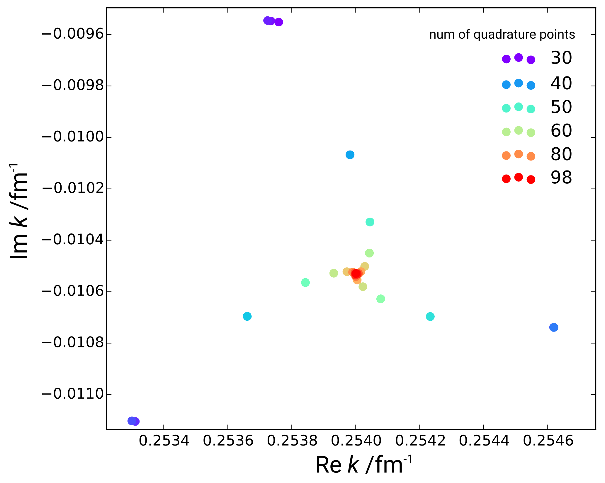
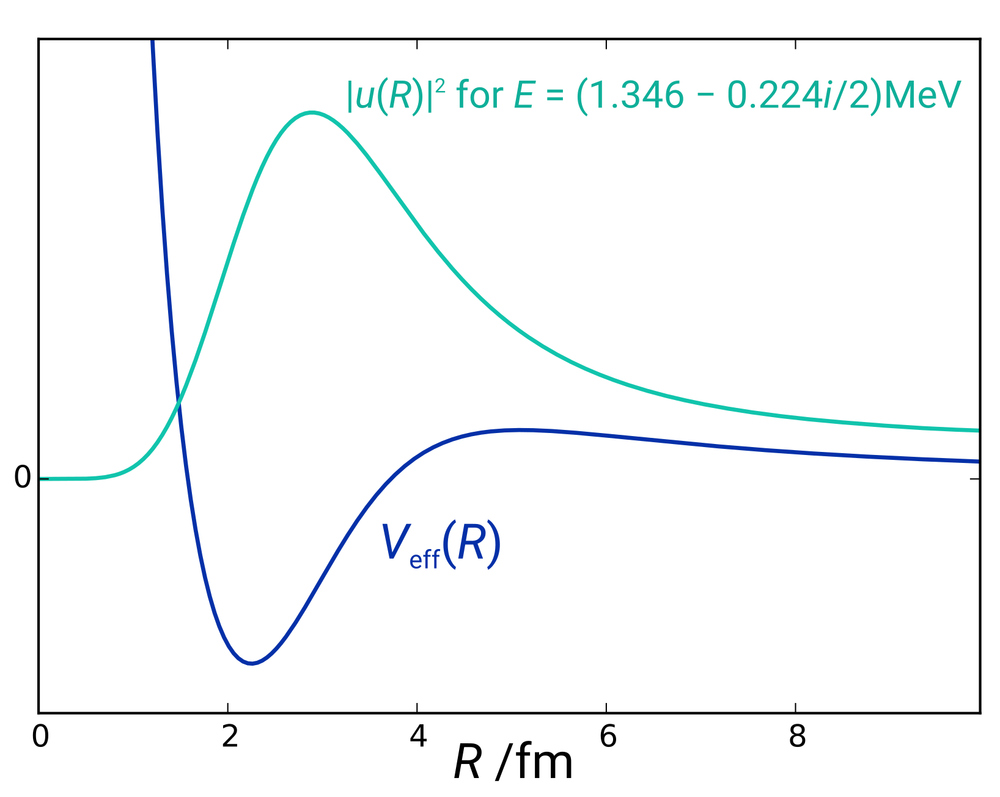
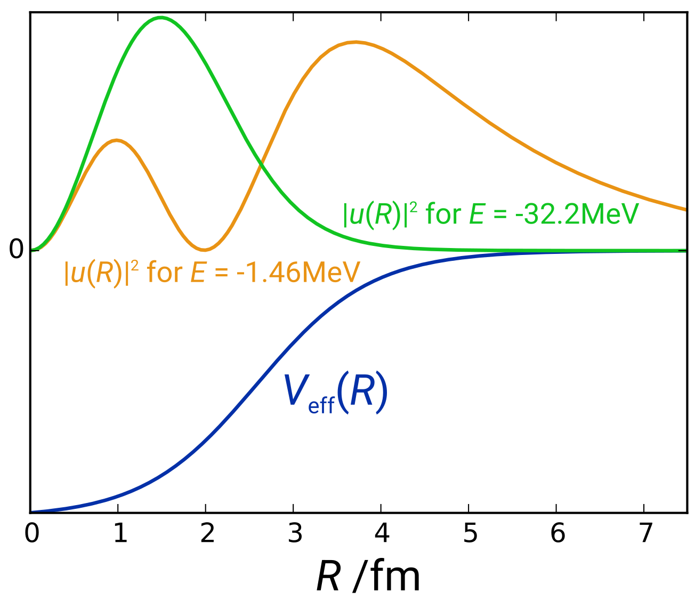

# The Berggren basis in elastic scattering

<small style="font-size: 80%">Fei Yuan

*PHY982 Project*

2015-05-05</small>

# Let's set up the problem

- 2 particles in relative frame
- short-ranged interaction
- spherical symmetry

With partial wave decomposition:

$$\left(-\frac{1}{2 \mu} \frac{d^2}{d R^2} +
\frac{l (l + 1)}{2 \mu R^2} + V(R)\right) u(R) = E u(R)$$

*What kinds of solutions would you expect?*

# There are bound states

- $u \to 0$
- discrete spectrum
- normalizable
- imaginary momenta

<small>(of course, they only exist if the interaction is sufficiently attractive)</small>

# and scattering states

*(a.k.a. "continuum states")*

*one of the main topics of this class*

- $u \to e^{\pm i k x}$
- continuous spectrum
- *not* normalizable
- real momenta

# but also resonance states

- $u \to e^{i (\pm k - i \kappa) x}$
- discrete spectrum
- not normalizable
- complex momenta
- **finite lifetime**

# all of which correspond to poles in the S-matrix

# How do they relate to each other?  <i>Newton completeness relation</i>*

*any state is a linear combination of bound and scattering states*

$$\sum_{k \in \text{bound}} |\varphi_k\rangle \langle \varphi_k|
+ \int_0^\infty k^2 d k\, |\varphi(k)\rangle \langle \varphi(k)| = \hat 1$$

but what about resonance states?

<small>*[R. G. Newton, <i>Scattering Theory of Waves and Particles</i>](https://books.google.com/books?id=uYmtAQAAQBAJ)</small>

# What if we deform the contour?

# We then obtain the <i>Berggren completeness relation</i>*

$$\sum_{k \in \text{enclosed b+d}} |\varphi_k\rangle \langle \varphi_k|
+ \int_{\mathrm L_+} k^2 d k\, |\varphi(k)\rangle \langle \varphi(k)| = \hat 1$$

The discrete sum is over all the poles enclosed by the contour on the upper
half plane, which includes bound and resonance states.

<small>*[T. Berggren, <i>Nucl. Phys. A</i> <b>109</b> (1968) 265.](http://doi.org/10.1016/0375-9474%2868%2990593-9)</small>

# and hence the <i>Berggren basis</i>

**What do we get?**

- bound, scattering, *and resonance* states

**What's the price?**

- complex energies; $H$ is no longer hermitian!
- integral divergence (worse than scattering)

# Example in free space

# But it's not that bad

- formally, can use nonhermitian quantum mechanics with a rigged Hilbert space (not as crazy as it sounds)
- regularization techniques to fix the integral:
    - Gaussian regularization ($e^{-\varepsilon R^2}$, then take limit as $\varepsilon \to 0$)
    - complex scaling (rotate the contour until it becomes well-behaved)

# So about that scattering problem…

Let's find the Berggren states of the 11Be system studied in homework 1.

We will use **basis expansion** and we will solve this in momentum space (which is quite natural for Berggren states).

# Here's the momentum-space Schrödinger equation

(can be derived by taking a Fourier transform)

$$\frac{k^2}{2 \mu} \varphi(k) + \int_0^\infty \kappa^2 d \kappa\, V(k, \kappa) \varphi(\kappa) = E \varphi(k)$$

where $V(k, \kappa) \equiv \frac2\pi \int_0^\infty R^2 d R\, j_l(k R) V(R) j_l(\kappa R)$

# Then we discretize the continuum

$$\frac{k^2}{2 \mu} \varphi_k + \sum_\kappa \kappa^2 w_\kappa V_{k \kappa} \varphi_\kappa = E \varphi_k$$

Points may be chosen via a quadrature scheme with weights $w_\kappa$.

We'll use Gauss-Legendre here.

# and obtain an eigenvalue problem

which we can plug into Lapack or something

$$\sum_\kappa H_{k \kappa} \varphi_\kappa = E \varphi_k$$

where $H_{k \kappa} = \frac{k^2}{2 \mu} \delta_{k \kappa} + \kappa^2 w_\kappa V_{k \kappa}$

# How do we recover the position-space wavefunction?

Just do a Hankel transform:

$$u(R) = i^l \sqrt{\frac2\pi} R \sum_k k^2 w_k j_l(k R) \varphi_k$$

# What does the contour look like?

# Recall from our first homework

# Do we get the right answer?

# How well does it converge? (I)

# How well does it converge? (II)

<!-- converges extremely fast w.r.t. k_max (>= 3 is enough) -->
<!-- converges extremely fast w.r.t. R_max (>= 30 is enough) -->
<!-- mostly insensitive (< 1e-9 fluctuation) to k_b -->

# What does the state look like?

# There are bound states too!

(in $l = 0$)

# What do those look like?

# Unanswered questions…

- *How do the states behave asymptotically?*  Accurate asymptotics seems to be hard to obtain in this approach.  Might require a lot more points.

- *How can we do this more efficiently?*  Calculating the momentum matrix elements of $V$ is the dominant expense.  It gets worse as the momentum increases: the integrals become extremely oscillatory.
